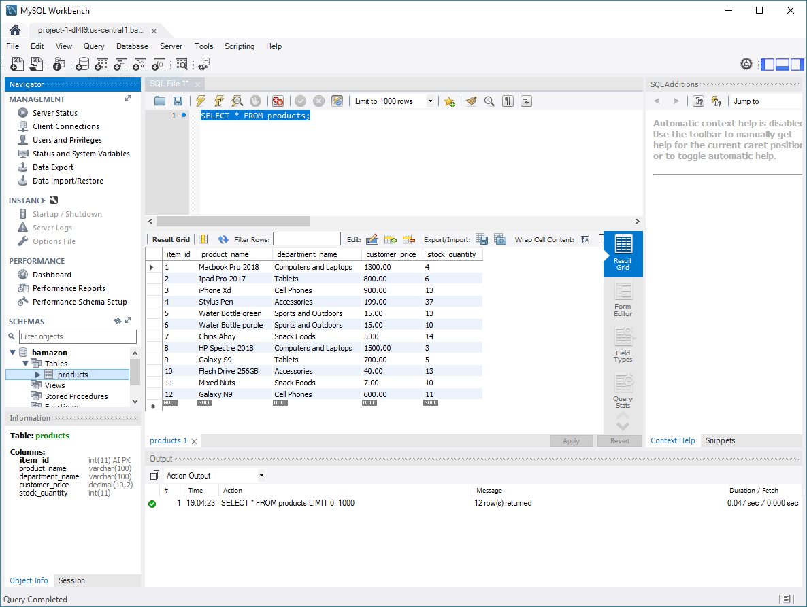

# Bamazon
In this activity, I created a digital storefront with MySQL and Node JS. The app takes in orders from customers and depletes stock from the store's inventory. 

_Screenshot of the database running in MySQL Workbench:_

_Video (swf) of "Bamazon" running in the CLI:_
[cli video](assets/bamazon_operations.swf)

_Alternate video for CLI operations (youtube):_
[yt cli video](https://youtu.be/zywtwDyucMw)
